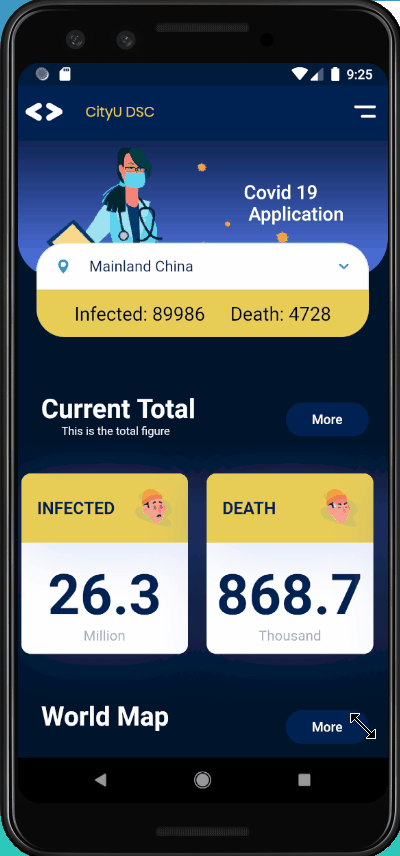
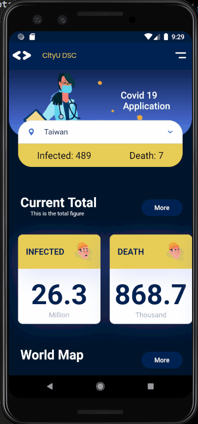

# covid19app

A flutter project form CityU DSC.

## Goal
The goal is to allow user access the current situation of Covid-19 clearly, correctly and rapidly. It is also the real-time-covid19 app, which fetching data from an external [api](https://api.covid19api.com/).\
We use **flutter** to develop this app, which is friendly to ios and android user at the same time.\
And for our team, the main goal is to try out developing new stuff even in this hard time and chaotic situation~ 

## Author
@ryanyen\
@eugene\
@luke\
@shawn\
@leon

## Work Division
UI/ Home page : Ryanyen/ Leon\
API/ data : Eugene/ Leon/ Shawn/ Luke\
WorldList Page: Shawn/ Luke/ Eugene\
Project Manager: Ryanyen

---

## Live Demo
[Link to demo video](https://www.youtube.com/watch?v=gbIX8AJ4DXA)

## Gif Demo
\
\

## Getting Started

This project is a starting point for a Flutter application.

A few resources to get you started if this is your first Flutter project:

- [Lab: Write your first Flutter app](https://flutter.dev/docs/get-started/codelab)
- [Cookbook: Useful Flutter samples](https://flutter.dev/docs/cookbook)

For help getting started with Flutter, view our
[online documentation](https://flutter.dev/docs), which offers tutorials,
samples, guidance on mobile development, and a full API reference.
